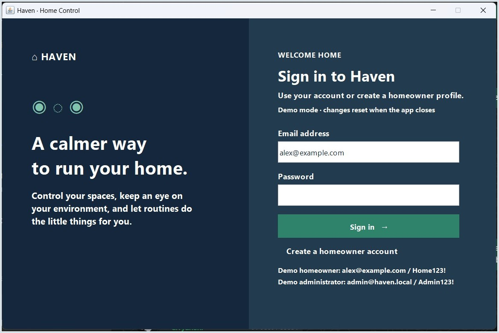
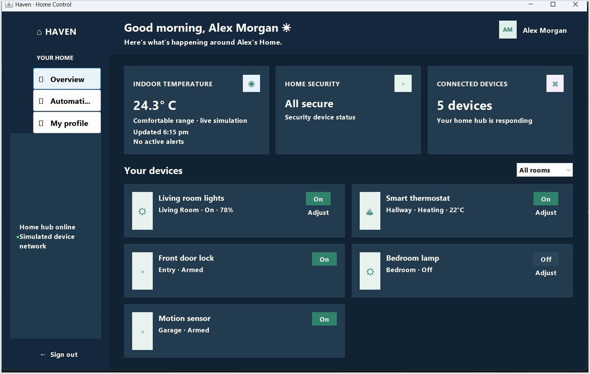
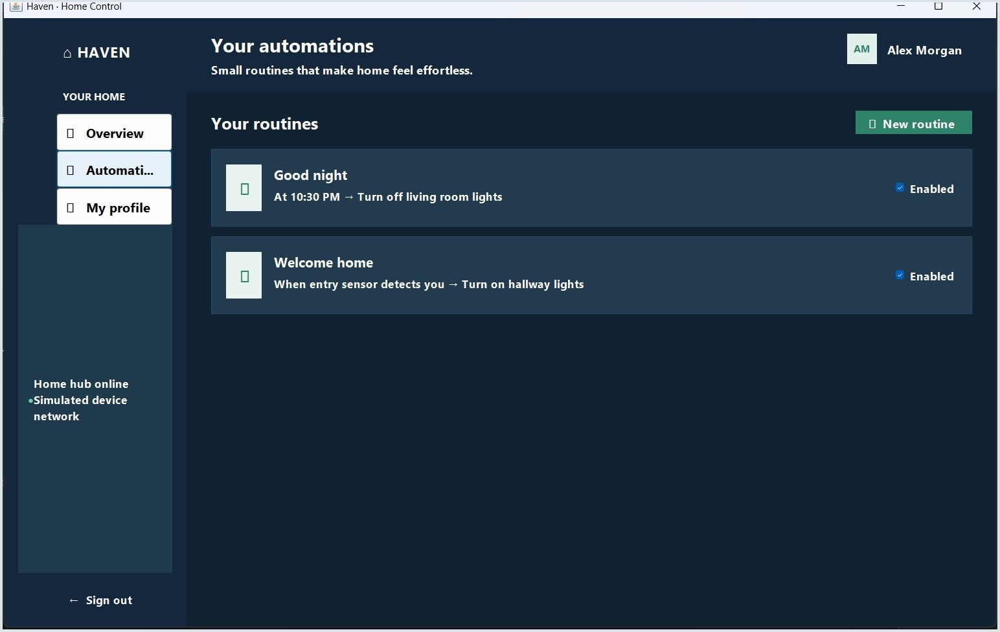
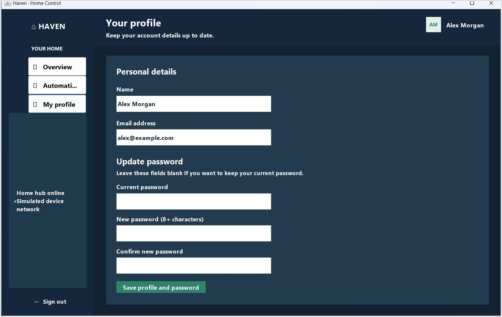
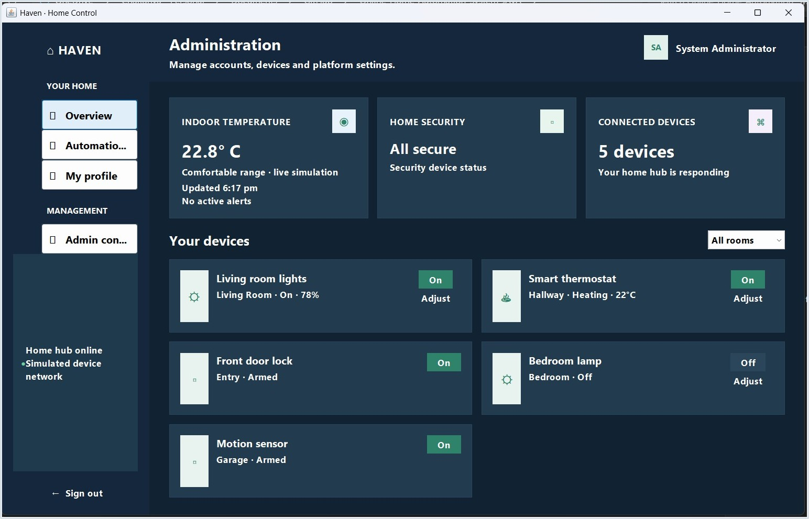
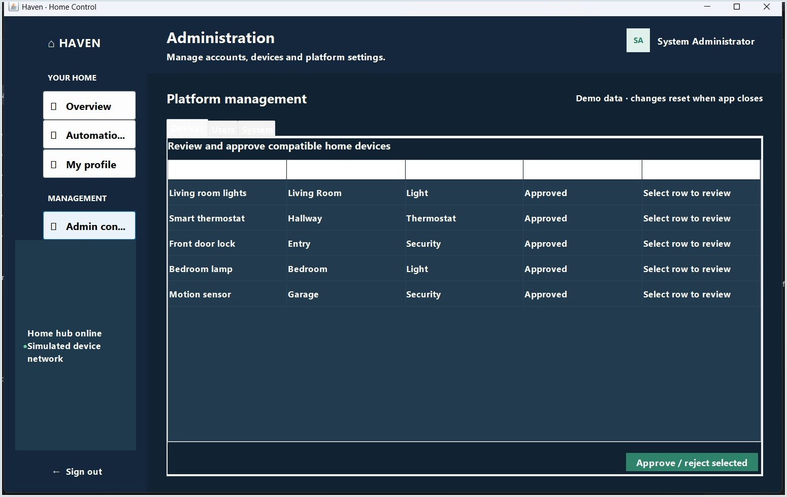
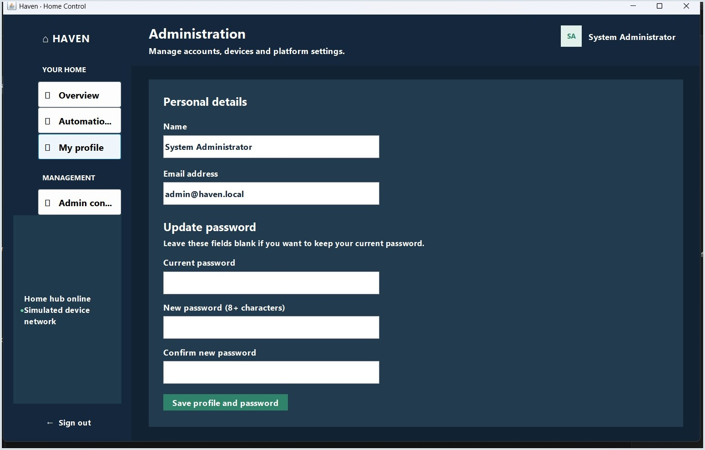

# Online Home Automation Control Platform

A Java Swing desktop app for exploring home automation controls. It includes homeowner registration and sign-in, an administrator workspace, simulated devices, automation routines, environment readings, and an SQLite persistence option.

> Device commands and environment readings are simulated. This classroom project does not connect to physical home devices.

## Features

- Login for Homeowner and Administrator roles, plus homeowner account creation.
- Profile-based password changes require the current password and confirmation of the new password.
- Passwords are stored as salted PBKDF2 hashes in the app's repositories.
- Homeowner overview for device status, room filtering, security state, and temperature alerts.
- Simulated on/off controls and brightness/thermostat adjustment.
- Automation routines with editable enable/disable status.
- Profile editing for account name and email.
- Administrator user creation, editing, role assignment, and removal, with safeguards for the active and final administrator.
- Device compatibility approval and system settings.
- A background environment monitor, generic repository interface, synchronized operations, and JDBC SQLite persistence.

## Requirements

- JDK 21 or later.
- For a quick in-memory demo: the JDK only.
- For SQLite persistence and the packaged JAR: Maven 3.9 or later and internet access for the first dependency download.

## Run the in-memory demo

Open PowerShell in this project folder and run:

```powershell
Set-ExecutionPolicy -Scope Process -ExecutionPolicy Bypass
.\run-demo.ps1
```

The policy change applies only to that PowerShell window. The app compiles from source and launches with demo data. Demo-mode changes are cleared when the app closes.

### First-time walkthrough

1. Sign in with one of the demo accounts below, or choose **Create a homeowner account** to register.
2. A homeowner can use **Overview** to check temperature, security, and connected devices. Use the device controls to switch a device on or off; **Adjust** is available for supported lights and thermostats.
3. Open **Automations** to create a routine by choosing its condition and action, then enable or disable it as needed.
4. Open **My profile** to edit account details or change the password. Password changes ask for the current password and confirmation of the new one.
5. Sign in as the administrator to open **Admin console**. Its sections provide user management, compatibility decisions for devices, system settings, and system monitoring.

The application displays confirmation or validation messages when an action succeeds or needs attention. Device behavior and environment values are simulated.

### Demo accounts

| Role | Email | Password |
|---|---|---|
| Homeowner | `alex@example.com` | `Home123!` |
| Administrator | `admin@haven.local` | `Admin123!` |

Use **Create a homeowner account** to register another homeowner. Public registration cannot create administrator accounts.

## Run with persistent SQLite storage

From the project folder, build the runnable JAR:

```powershell
mvn clean package
```

Then set the database URL and launch the JAR:

```powershell
$env:HOME_AUTOMATION_DB = 'jdbc:sqlite:home-automation.db'
java -jar target/home-control-platform-1.0.0.jar
```

The app creates the database tables and sample records on first launch. Users, devices, automation routines, and system settings are saved in the SQLite database. Environment readings are simulated for the current app session.

To return to in-memory demo mode, close the app and open a new PowerShell window without setting `HOME_AUTOMATION_DB`.

## Rubric mapping

- **OOP:** `SmartDevice` inheritance, concrete device types, `Switchable`, polymorphic status, and validation/SQL exceptions.
- **Collections and generics:** typed lists and repository collections; thread-safe listener collection.
- **Multithreading and synchronization:** background environment monitor and synchronized device/repository state.
- **Database operations and JDBC:** `HomeRepository`, `InMemoryHomeRepository`, and `JdbcHomeRepository`.

This is a desktop GUI project. It does not implement Servlets or a web interface.

## Screenshots

The screenshots below show the application with its demo data. The copies in `screenshots/readme/` have a narrow border, and a small strip above the app window has been cropped from screenshots where it appeared. The original captures remain in `screenshots/`.

### Sign-in



### Homeowner dashboard and features

**Overview and device controls**



**Automation routines**



**Profile and password update**



### Administrator dashboard and features

**System overview**



**Device compatibility review**



**Administrator profile**



The supplied captures do not include the administrator user-management or system-settings panels. Add those views later if you want the README gallery to document every admin feature.

## Project structure

```text
src/main/java/edu/homeautomation/
  Main.java
  model/                  Devices, users, routines, and environment readings
  persistence/            Repository interface and demo/JDBC implementations
  service/                Device control, environment monitor, password hashing
  ui/                     Sign-in, registration, and role dashboards
src/main/resources/schema.sql
```

## Classroom demo note

The seeded accounts are for demonstration only. Replace them with a proper account provisioning and recovery flow before using the software outside a classroom setting.
